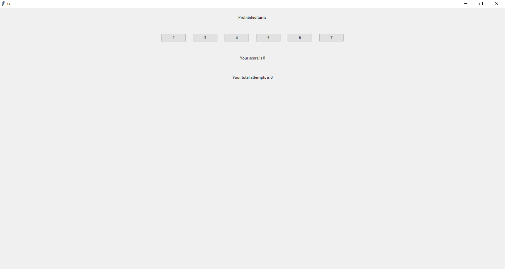
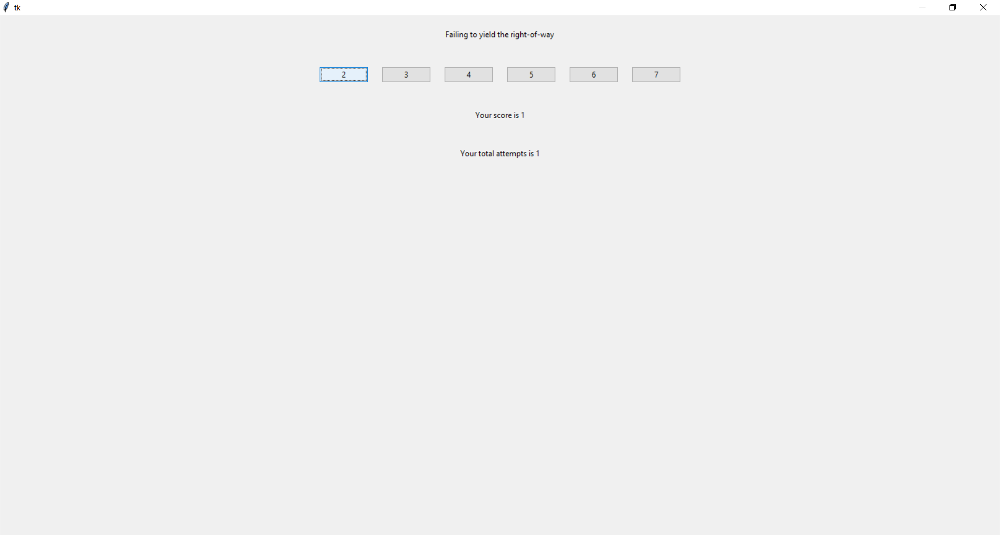
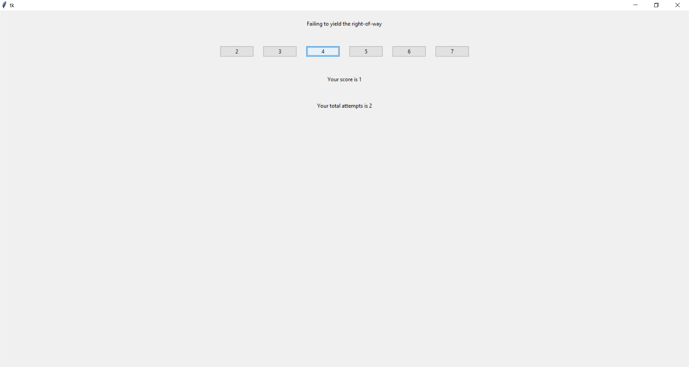
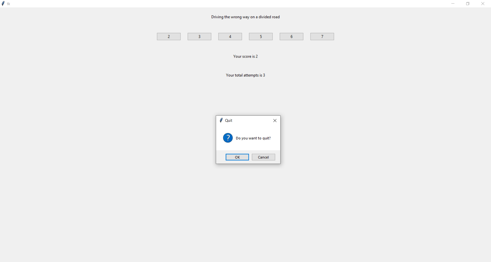
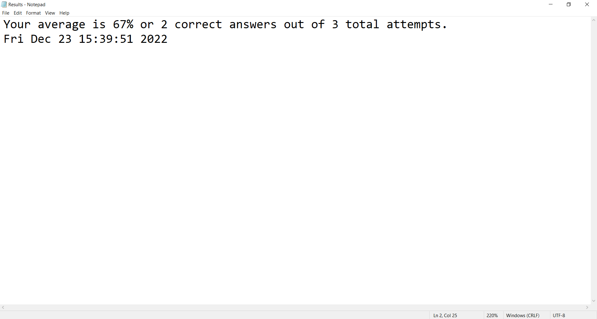

# Demerit-Points-Quiz
 A Tkinter application designed to test your knowledge of Ontario's Demerit Point system for G1 test
 
 ## Features:
 - Allows for many attempts per question
 - Displays the score and number of attempts for the run
 - Saves the result of each run so the user can track their progress in the Results.txt file
 - Displays a popup to verify if the user wants to close the quiz

## Images:

#### Initial Startup of Quiz:

#### Correct Answer:

#### Wrong Answer:

#### Closing Window Popup:

#### Results File:

 ## I learned how to:
 - Build a simple Tkinter application
 - Change the displayed text (question) and the correct score button
 - Read and write to text files
 - Make a custom text parsing algorithm
 - Implement dataclasses to speed up development
 - Display a popup to verify the closing of the window 

